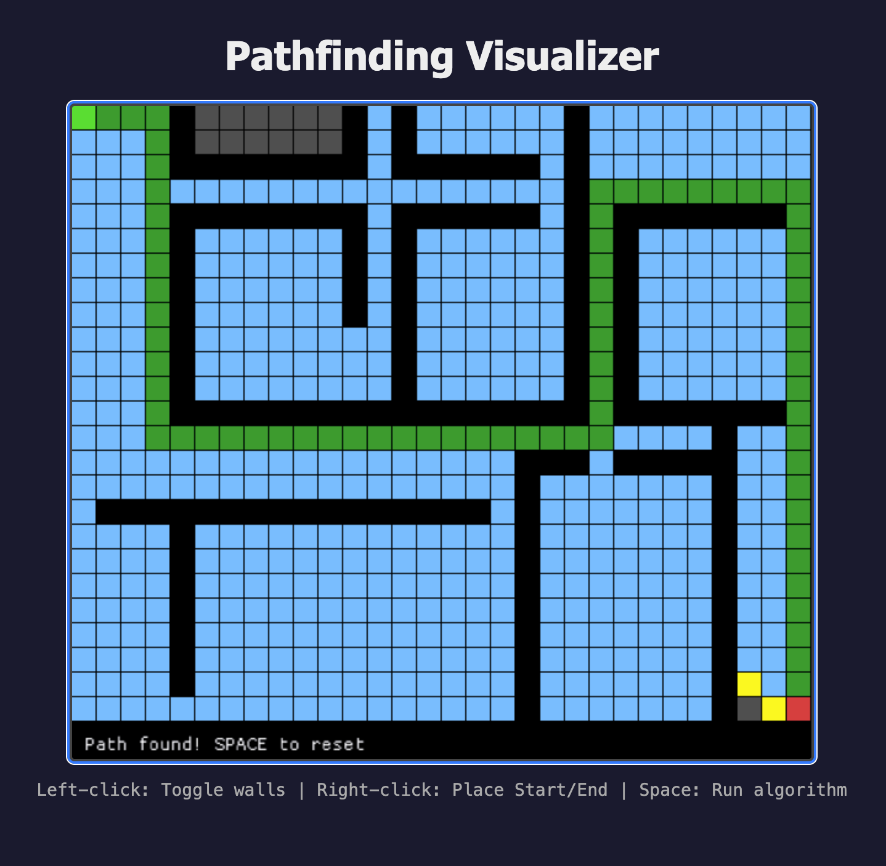

# Pathfinding Visualizer



A playground project for learning and visualizing pathfinding algorithms in Rust.

## Live Demo

Try it out in your browser: **[joonaspessi.github.io/path_finding](https://joonaspessi.github.io/path_finding/)**

## Build Instructions

### Prerequisites

- [Rust](https://rustup.rs/) (latest stable)
- For web builds: `wasm32-unknown-unknown` target

```bash
rustup target add wasm32-unknown-unknown
```

### Native Build

```bash
# Debug build
cargo build

# Release build
cargo build --release

# Run
cargo run --release
```

### WebAssembly Build

```bash
# Build for web
./build_web.sh

# The wasm file will be copied to docs/
# Open docs/index.html in a browser to test locally
```

## License

This project is licensed under the MIT License - see the [LICENSE](LICENSE) file for details.
